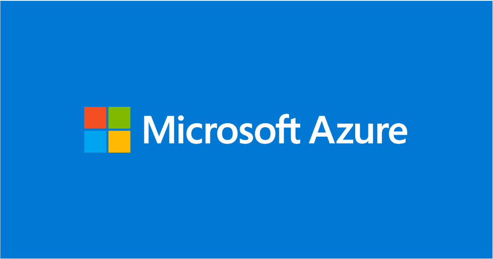
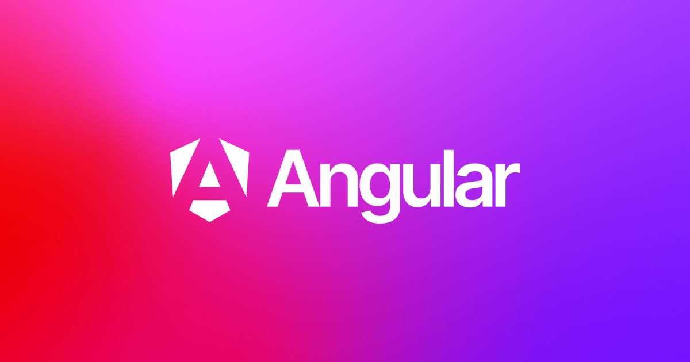
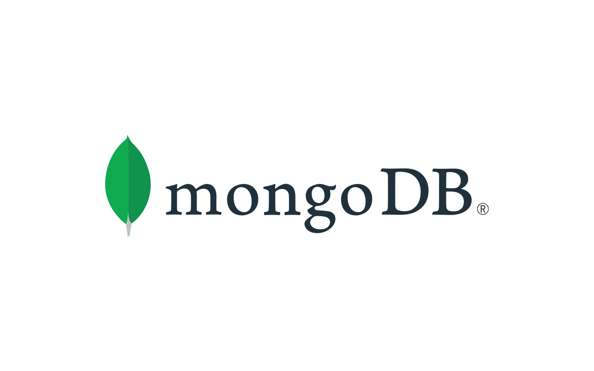
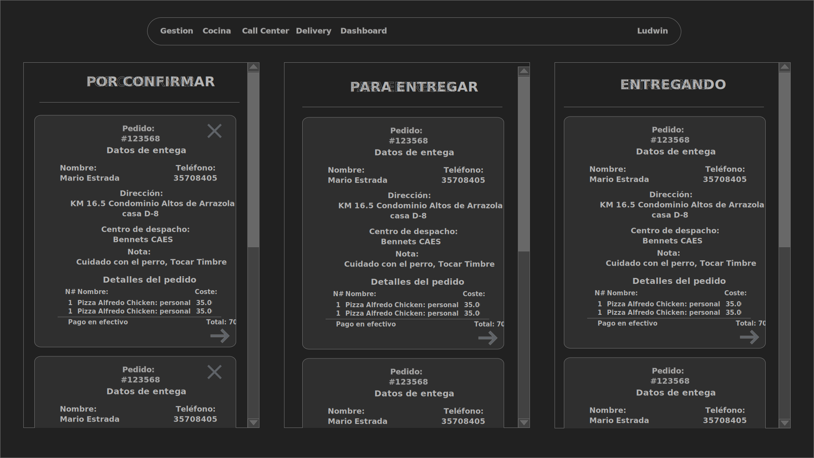

## Ecosistema Tecnológico del Proyecto

´´

´´
### ¿Qué es Azure?

Azure es la plataforma de servicios en la nube de Microsoft que ofrece una amplia gama de servicios como computación, almacenamiento y redes. Permite a las empresas crear, desplegar y gestionar aplicaciones a través de una red global de centros de datos.

´´
### ¿Cómo Usaremos Azure en Nuestra Aplicación?
 
´´
### Azure Kubernetes Service (AKS)

Utilizaremos AKS para desplegar, gestionar y escalar nuestras aplicaciones en contenedores. AKS facilita la orquestación de contenedores Docker y proporciona un entorno flexible y escalable.

´´
### Azure DevOps

Usaremos Azure DevOps para gestionar el ciclo de vida del desarrollo de software, incluyendo integración continua y despliegue continuo (CI/CD). Esto nos permitirá automatizar y optimizar el proceso de desarrollo y entrega de nuestra aplicación.

´´

### Beneficios De Azure

- **Fiabilidad y Rendimiento**: Infraestructura robusta y alta disponibilidad.
- **Seguridad y Cumplimiento**: Protección de datos con mejores prácticas.
- **Flexibilidad y Escalabilidad**: Recursos ajustables según la demanda.
- **Reducción de Costos**: Eliminación de inversiones iniciales en hardware.

´´
<section>
  <h2>Costos de Servicios</h2>
  <table style="font-size: 25px;">
    <thead>
      <tr>
        <th>Servicio</th>
        <th>Producto</th>
        <th>Descripcion</th>
        <th>Cantidad</th>
        <th>Costo</th>
        <th>Total por mes (10 horas/día)</th>
      </tr>
    </thead>
    <tbody>
      <tr>
        <td>Kubernetes</td>
        <td>AKS</td>
        <td>Se solicitará un cluster</td>
        <td>1</td>
        <td>$73/cluster/mes</td>
        <td>$73</td>
      </tr>
      <tr>
        <td>VM</td>
        <td>B2ats: 2 vCPUs, 1GB RAM</td>
        <td>Utilizada para los microservicios backend y frontend.</td>
        <td>8</td>
        <td>$0.009/hora</td>
        <td>$22</td>
      </tr>
      <tr>
        <td>VM</td>
        <td>D2as v5: 2 vCPU, 8GB RAM</td>
        <td>Para MongoDB</td>
        <td>1</td>
        <td>$0.086/hora</td>
        <td>$26</td>
      </tr>
      <tr>
        <td>VNET</td>
        <td>Azure VNET</td>
        <td>Red privada para utilizarla con AKS y clientes a los microservicios</td>
        <td>1</td>
        <td>$4 por 200GB de tráfico al mes</td>
        <td>$4</td>
      </tr>
      <tr>
        <td>Storage Account</td>
        <td>SSD Premium V2: 128GB, 3000 IOPS, 250MB/s</td>
        <td>Almacenamiento dedicado para MongoDB.</td>
        <td>1</td>
        <td>$16/mes</td>
        <td>$16</td>
      </tr>
      <tr>
        <td></td>
        <td></td>
        <td></td>
        <td></td>
        <td><b>Total</b></td>
        <td>$141</td>
      </tr>
    </tbody>
  </table>
</section>

´´

´´
### ¿Que es Angular?

Angular es un framework para aplicaciones web desarrollado en TypeScript, de código abierto, mantenido por Google, que se utiliza para crear y mantener aplicaciones web de una sola página. Su objetivo es aumentar las aplicaciones basadas en navegador con capacidad de Modelo Vista Controlador (MVC), en un esfuerzo para hacer que el desarrollo y las pruebas sean más fáciles.

´´

´´
### Node.js

es un entorno en tiempo de ejecución multiplataforma, de código abierto, para la capa del servidor (pero no limitándose a ello) basado en el lenguaje de programación JavaScript, asíncrono, con E/S de datos en una arquitectura orientada a eventos y basado en el motor V8 de Google. Fue creado con el enfoque de ser útil en la creación de programas de red altamente escalables, como por ejemplo, servidores web. Fue creado por Ryan Dahl en 2009 y su evolución está apadrinada por la empresa Joyent, que además tiene contratado a Dahl en plantilla.

´´

´´
### MongoDB

MongoDB es un sistema de base de datos NoSQL, orientado a documentos y de código abierto.

En lugar de guardar los datos en tablas, tal y como se hace en las bases de datos relacionales, MongoDB guarda estructuras de datos BSON (una especificación similar a JSON) con un esquema dinámico, haciendo que la integración de los datos en ciertas aplicaciones sea más fácil y rápida.

´´´

## Solución técnica

´´
Se desarrollará un sistema con una arquitectura de Microservicios con un portal web como interfaz de usuario. El sistema será alojado en el proveedor de sistemas en la nube Azure, y se utilizarán distintas máquinas virtuales para cada microservicio y el frontend. Para la gestión de cada máquina virtual se utilizará Kubernetes, permitiendo que cada funcionalidad del sistema sea escalable horizontalmente.

´´
### Diagrama de arquitectura

´´
### Diagrama de Secuencia del modelo del negocio
 

´´
### Diagrama de Secuencia de de los elementos del sistema.

´´
### Diagrama de Secuencia de de los elementos del sistema.

´´
### Diagrama de Secuencia de de los elementos del sistema.

´´
### Diagrama de Secuencia de de los elementos del sistema.

´´
### Diagrama de Secuencia de de los elementos del sistema.

´´
### Diagrama de Secuencia de de los elementos del sistema.

´´´
### Interfaz Grafica de Usuario (GUI)

´´´

´´

´´

´´

´´

´´

´´

´´

´´

´´´

´´

´´

´´

´´

´´

´´´

´´´

´´

´´´

´´´
## Costos de desarrollo

´´
<section>
  <h2>Costos de desarrollo</h2>
  <table style="font-size: 25px;">
    <thead>
      <tr>
        <th style="color: #76D0EB;">Concepto</th>
        <th style="color: #76D0EB;">Costo</th>
      </tr>
    </thead>
    <tbody>
      <tr>
        <td>Gestión de pedidos</td>
        <td>95.000</td>
      </tr>
      <tr>
        <td>Cocina</td>
        <td>15.000</td>
      </tr>
      <tr>
        <td>Servicio de entrega</td>
        <td>15.000</td>
      </tr>
      <tr>
        <td>Cierre Contable (dashboard)</td>
        <td>20.000</td>
      </tr>
      <tr>
        <td>Gestión del Menú</td>
        <td>10.000</td>
      </tr>
      <tr>
        <td>Gestión de SAC</td>
        <td>8.000</td>
      </tr>
      <tr>
        <td>Gestión de Motoristas</td>
        <td>8.000</td>
      </tr>
      <tr>
        <td>Gestión de clientes</td>
        <td>8.000</td>
      </tr>
      <tr>
        <td>Login</td>
        <td>20.000</td>
      </tr>
      <tr>
        <td>Gestión de sucursales</td>
        <td>8.000</td>
      </tr>
      <tr>
        <td style="color: #76D0EB;"><b>Sub total</b></td>
        <td style="color: #76D0EB;"><b>207.000</b></td>
      </tr>
      <tr>
        <td>Configuración e implementación de infraestructura</td>
        <td>30.000</td>
      </tr>
      <tr>
        <td><s>Automatización de despliegues (CI)<s></td>
        <td><s>30.000<s></td>
      </tr>
      <tr>
        <td><s>Toma de requerimientos (BI)<s></td>
        <td><s>4.000<s></td>
      </tr>
      <tr>
        <td><s>Documentación y diseño de la arquitectura del sistema<s></td>
        <td><s>500.000<s></td>
      </tr>
      <tr>
        <td style="color: #76D0EB;"><b>Total</b></td>
        <td style="color: #76D0EB;"><b>237.000</b></td>
      </tr>
    </tbody>
  </table>
</section>

´´
<section>
  <h2>Costos del servicio en la nube Mensual (Infraestructura)</h2>
  <table style="font-size: 25px;">
    <thead>
      <tr>
        <th>Servicio</th>
        <th>Producto</th>
        <th>Descripcion</th>
        <th>Cantidad</th>
        <th>Costo</th>
        <th>Total por mes (10 horas/día)</th>
      </tr>
    </thead>
    <tbody>
      <tr>
        <td>Kubernetes</td>
        <td>AKS</td>
        <td>Se solicitará un cluster</td>
        <td>1</td>
        <td>$73/cluster/mes</td>
        <td>$73</td>
      </tr>
      <tr>
        <td>VM</td>
        <td>B2ats: 2 vCPUs, 1GB RAM</td>
        <td>Utilizada para los microservicios backend y frontend.</td>
        <td>8</td>
        <td>$0.009/hora</td>
        <td>$22</td>
      </tr>
      <tr>
        <td>VM</td>
        <td>D2as v5: 2 vCPU, 8GB RAM</td>
        <td>Para MongoDB</td>
        <td>1</td>
        <td>$0.086/hora</td>
        <td>$26</td>
      </tr>
      <tr>
        <td>VNET</td>
        <td>Azure VNET</td>
        <td>Red privada para utilizarla con AKS y clientes a los microservicios</td>
        <td>1</td>
        <td>$4 por 200GB de tráfico al mes</td>
        <td>$4</td>
      </tr>
      <tr>
        <td>Storage Account</td>
        <td>SSD Premium V2: 128GB, 3000 IOPS, 250MB/s</td>
        <td>Almacenamiento dedicado para MongoDB.</td>
        <td>1</td>
        <td>$16/mes</td>
        <td>$16</td>
      </tr>
      <tr>
        <td></td>
        <td></td>
        <td></td>
        <td></td>
        <td><b>Total</b></td>
        <td>$141</td>
      </tr>
    </tbody>
  </table>
</section>

´´
### Costos de mantenimiento

1. **Nosotros le damos soporte**

   - Precio: 10.000 (Resolución de incidencias por la tarde/noche)
   - Precio: 15.000 (5 días a la semana, 8 horas laborales)

2. **Usted contrata a su propio personal  de sistemas.**

   Precio: a convenir

3. **Nosotros le buscamos a la persona encargada  del sistema.**

   Precio: 2.000 por persona evaluada.